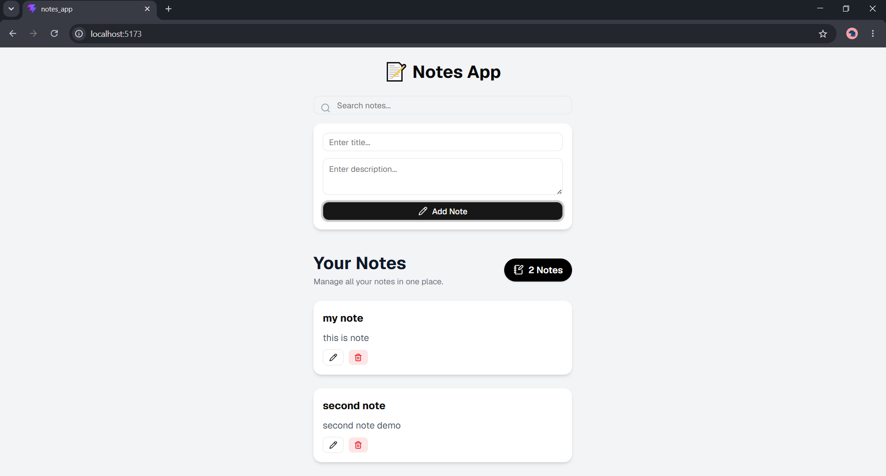

# 📝 Notes App

A modern, responsive notes management application built with React, Vite, and Tailwind CSS. Create, edit, delete, and search through your notes with a clean and intuitive interface.

## Preview

<!-- Add your screenshot here -->


## Features

- **Create Notes**: Add new notes with title and description
- **Edit Notes**: Update existing notes with ease
- **Delete Notes**: Remove notes you no longer need
- **Search**: Quickly find notes by title
- **Responsive Design**: Works seamlessly on desktop and mobile devices
- **Modern UI**: Clean interface built with shadcn/ui components
- **Note Counter**: Track the total number of notes

## Tech Stack

- **React 19** - UI library
- **Vite** - Build tool and dev server
- **Tailwind CSS v4** - Styling
- **shadcn/ui** - UI components
- **Radix UI** - Headless UI primitives
- **Lucide React** - Icons
- **Geist Font** - Typography

## Installation

1. Clone the repository
2. Install dependencies:
   ```bash
   npm install
   ```

## Usage

1. Start the development server:
   ```bash
   npm run dev
   ```

2. Open your browser and navigate to `http://localhost:5173`

3. Build for production:
   ```bash
   npm run build
   ```

4. Preview production build:
   ```bash
   npm run preview
   ```

## Project Structure

```
src/
├── components/
│   ├── NoteForm.jsx      # Form for adding/editing notes
│   ├── NoteItem.jsx      # Individual note display
│   ├── NoteList.jsx      # List of all notes
│   ├── SearchBar.jsx     # Search input component
│   └── ui/               # shadcn/ui components
├── App.jsx               # Main application component
├── main.jsx              # Entry point
└── index.css             # Global styles
```
